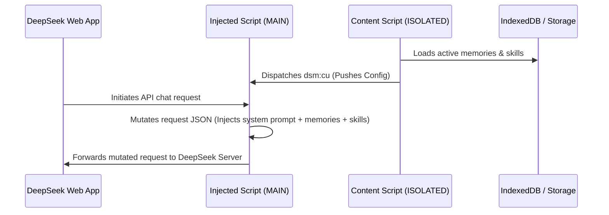

# DeepSeek Memory & Skills Extension - Technical Breakdown

This document provides a comprehensive technical overview and breakdown of the **DeepSeek Memory** extension (internally referenced as `Deepseek-SuperVisor`).

---

## 1. Project Overview

**DeepSeek Memory** is a Manifest V3 Google Chrome extension built for [chat.deepseek.com](https://chat.deepseek.com). It enhances the web experience of the DeepSeek chat platform by adding two primary features:
1. **Persistent Memory**: Automatically extracts facts from assistant messages using structured tags, saves them locally, and injects them back into subsequent prompts so the model retains context across multiple independent chat sessions.
2. **Custom Skills System**: Allows users to import and toggle markdown-based system instructions or workflows, injecting them into the chat context.

All settings, skills, and memory data are stored **entirely locally** on the user's browser, prioritizing privacy and security.

---

## 2. Technical Stack

* **UI Framework**: Svelte 5 (built with modern runes such as `$state`, `$derived`, `$effect`, and `$props`).
* **Bundler & Build Tool**: Vite 6, using a custom build script (`build.js`) to bundle separate targets.
* **Storage Backends**:
  * **IndexedDB**: The primary transactional store for memory entries, settings, and skills (leveraging ACID transactions and migration tools).
  * **chrome.storage.local**: Fallback storage if IndexedDB is disabled/unavailable, and primary store for general settings.
* **Target Environment**: Manifest V3 Chrome Extension (injected content scripts and a background service worker).

---

## 3. Architecture & File Structure

Here is a mapping of the codebase's main files and folders:

```
├── static/
│   └── manifest.json         # Extension configuration, matching permissions/scripts
├── build.js                  # Custom Vite build coordinator compiling 3 targets
├── src/
│   ├── platform/
│   │   └── globals-chrome.js # Platform-specific setups (e.g., Chrome/Android aliasing)
│   ├── locales/              # i18n JSON files (English, Chinese, Russian, Turkish)
│   ├── styles/               # Styling entry points for content script UI
│   ├── lib/
│   │   ├── constants.js      # Global keys, prompts, and defaults
│   │   ├── i18n.svelte.js    # Svelte-managed translation module
│   │   └── indexeddb-storage.js # SQLite-like wrapper managing IndexedDB & Migrations
│   ├── background/
│   │   └── index.js          # Service worker bypass for CORS (fetching remote skills)
│   ├── injected/             # Executed in MAIN world (shares DOM context)
│   │   ├── index.js          # Patches fetch/XHR endpoints
│   │   ├── config.js         # Normalizes the active configs
│   │   ├── fetch-patch.js    # Fetch API hook
│   │   ├── xhr-patch.js      # XMLHttpRequest API hook
│   │   └── payload-mutator.js # Modifies API JSON requests to inject memory/skills
│   └── content/              # Executed in ISOLATED content-script world
│       ├── index.js          # Injected entry point (bootstrapping script)
│       ├── state.js          # Svelte-reactive global state
│       ├── storage.js        # Logic layer syncing chrome.storage and IndexedDB
│       ├── bridge.js         # Event-driven message broker with the MAIN world script
│       ├── scanner.js        # DOM MutationObserver capturing assistant memory writes
│       ├── parser/
│       │   ├── memory-parser.js # Parses XML memory-write tags from assistant
│       │   └── skill-parser.js  # Parses custom instructions
│       └── ui/               # Svelte UI component layer
│           ├── App.svelte       # App layout wrapper and global Toast listeners
│           ├── Drawer.svelte    # Settings sidebar drawer
│           ├── SettingsPanel.svelte # Controls general configs
│           ├── SkillList.svelte     # Custom instruction list and file uploader
│           ├── MemoryList.svelte    # Browsable table of all stored facts
│           ├── MemoryImport.svelte  # Exporting/importing utilities
│           └── SettingsIntegration.js # Native settings menu injector
```

---

## 4. Key Workflows

### A. API Interception & Injection Flow
Since content scripts run in an isolated environment, they cannot intercept request payloads directly. DeepSeek Memory bypasses this using a **two-world bridge**:



1. **Injection**: `bridge.js` appends `injected.js` into the DOM.
2. **Patching**: `injected/index.js` intercepts global `fetch` and `XMLHttpRequest`.
3. **Mutation**: When `/api/v0/chat/completion` is called, `payload-mutator.js` modifies the payload:
   * Inserts the `<MEMORY_SYSTEM>` block to guide the model on how to write memories.
   * Appends any enabled custom `<BDS:SKILLS>`.
   * Appends the user's stored memories as `<BDS:memory_calls>` inside a `<dsmemory>` tag.

---

### B. Memory Extraction & DOM Scrubbing Flow
When DeepSeek responds, it may issue commands to store details using `<BDS:memory_write>` tags. The extension handles these dynamically:

1. **Observation**: A `MutationObserver` in `scanner.js` watches the chat container for changes.
2. **Parsing**: When new text is rendered, it searches for tags matching:
   `<BDS:memory_write key="key" importance="always|called">fact</BDS:memory_write>`
3. **Saving**: If a valid write is found (filtered through a safety blacklist in `scanner.js`), it is committed to IndexedDB.
4. **Scrubbing**: The extension edits the DOM nodes in real-time, stripping all tags (`<dsmemory>`, `<BDS:memory_write>`, etc.) so that the user sees clean text without markup.
5. **Notification**: A temporary bubble ("*Memory saved: key*") is rendered next to the assistant's thinking section.

---

### C. UI Dropdown Integration
The extension achieves a native look-and-feel by injecting itself into DeepSeek's profile/settings dropdown:

1. `SettingsIntegration.js` observes the page for the appearance of `.ds-dropdown-menu`.
2. When detected, it searches for a native anchor item (e.g., "Get App" or "Download mobile App").
3. It inserts a custom `Memory & Skills` dropdown row right beneath the anchor.
4. Clicking it triggers a `dsm:open` event that `App.svelte` receives, raising the Svelte drawer panel.

---

## 5. Security & Privacy Design

* **No Server Connectivity**: The extension runs entirely offline. There are no tracking scripts, telemetries, or remote API endpoints.
* **CORS Safe**: The background service worker acts as a secure local proxy to retrieve remote Markdown URLs for the skill system (e.g., from GitHub) avoiding browser CORS blocks.
* **Validation Guards**: Safeguards in `scanner.js` prevent prompt injection where the model might try to overwrite critical user data with placeholders.
