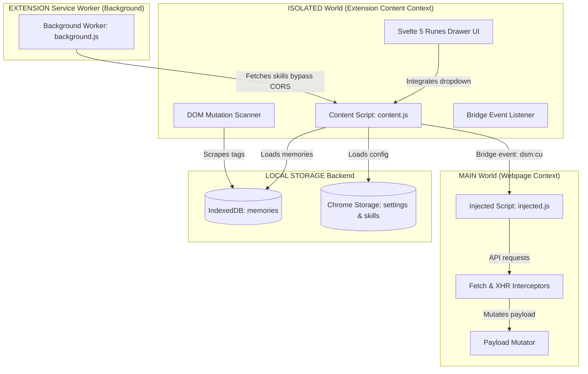

# Project Analysis: DeepSeek Memory & Skills

This artifact provides a comprehensive architectural and functional analysis of the **DeepSeek Memory** (also known as **Deepseek-SuperVisor**) extension.

---

## What is this project?

**DeepSeek Memory** is an Google Chrome extension designed for `chat.deepseek.com` that resolves a major limitation of LLM chat interfaces: **session-based amnesia**. By adding a local persistent memory layer and a custom instructions (skills) engine, it enables the model to recall user details, preferences, and workflows automatically in every new conversation, while maintaining strict local privacy. 
soon can use in edge,firefox,and etc... 

---

## Key Architectural Components

The extension operates across three distinct browser layers/contexts:

### 1. The Interception Engine (`injected/`)
* **Role**: Injected directly into the page's MAIN javascript world to bypass content-script sandbox isolation.
* **Mechanism**: Overrides default browser `window.fetch` and `window.XMLHttpRequest`.
* **Behavior**: Intercepts requests destined for `/api/v0/chat/completion`, `/api/v0/chat/edit_message`, and `/api/v0/chat_session/fetch_page`, calling `mutatePayload` before dispatching them.

### 2. The Mutation & Prompt Injector (`injected/payload-mutator.js`)
* **Role**: Seamlessly injects context into the user's prompt.
* **Injected Elements**:
  * **Memory System Instructions**: Injected on every message. Guides the model on using memory tags (`<BDS:memory_write>`) to save facts.
  * **Skills**: Injected on the first message or when skills change. Custom instructions loaded as raw Markdown files.
  * **Stored Memories**: Injected every turn as list tags: `<BDS:memory_calls importance="...">key: value</BDS:memory_calls>`.

### 3. The Extraction & DOM Scrubbing Engine (`content/scanner.js`)
* **Role**: Processes AI responses to store memories and hides tags from users.
* **Mechanism**: Watches the page DOM with a `MutationObserver` and polls periodically.
* **Extraction**: Captures `<BDS:memory_write key="..." importance="...">fact</BDS:memory_write>` in AI text, runs checks against a blacklist to avoid garbage values, and saves to local storage.
* **Scrubbing**: Removes all tags (`<dsmemory>`, `<BDS:memory_write>`, etc.) from the user's visible chat blocks.
* **Feedback**: Triggers a floating inline notification next to the chat indicating a memory has been captured.

### 4. Storage Architecture (`lib/indexeddb-storage.js`)
* **Role**: Stores data locally using transactional storage.
* **Design**: Uses an ACID-compliant **IndexedDB** database (`DeepSeekMemoryDB`) as the primary cache to store high-volume memory logs. Automatically migrates legacy records from standard Chrome local storage if needed.

### 5. Seamless Native UI Settings (`content/ui/`)
* **Role**: Custom configuration interface.
* **Features**: Injects a custom Svelte 5 drawer into DeepSeek's profile dropdown menu next to the "Get App" entry.
* **Tabs**:
  * **General Settings**: Toggle extension or change languages (supported by a fully localized Svelte i18n subsystem).
  * **Skills**: Upload and activate `.md` files as behavior modifiers.
  * **Memory**: Search, edit, update, delete, or manually import/export JSON memories.

---

## Key Highlights
* **Stealth**: Communicates via custom events using subtle, non-descript naming styles (`dsm:cu`, `dsm:rq`, etc.) and avoids console logs.
* **Privacy**: Zero remote tracking or external telemetry calls. Data never leaves the browser.
* **Cross-Language**: Matches tagging structures regardless of the language the user chats in.